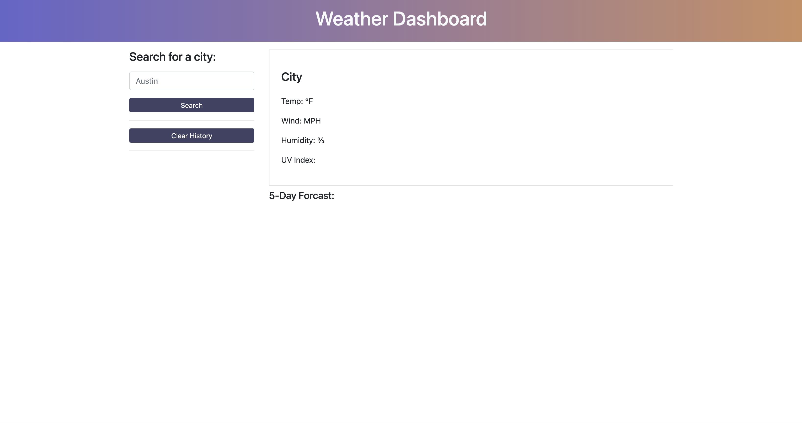
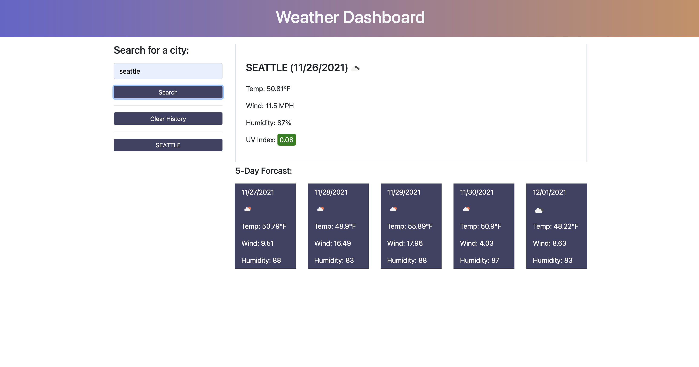
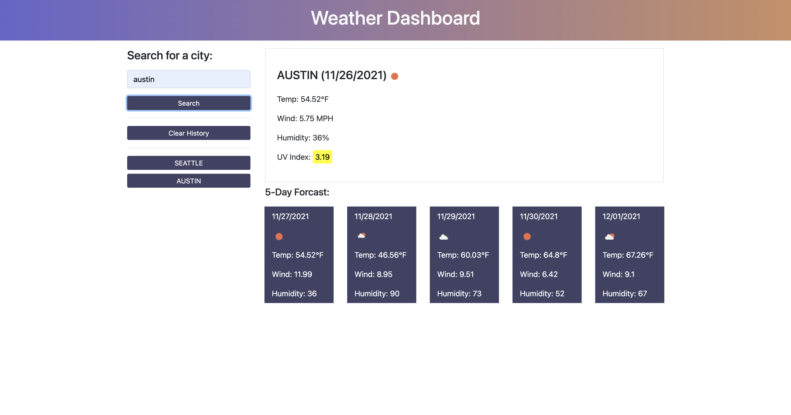
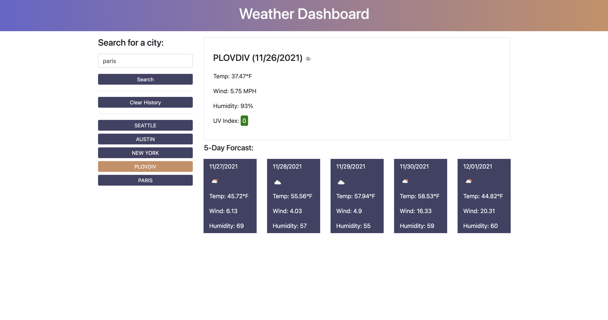
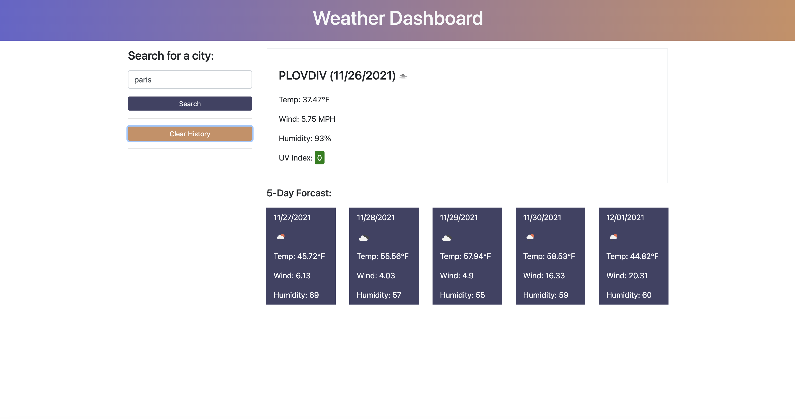

# Weather Dashboard

## Description

Weather app utilizing Bootstrap, Javascript, CSS, HTML the Open Weather Map API.

## Table of Contents
- [Weather Dashboard](#weather-dashboard)
  - [Description](#description)
  - [Table of Contents](#table-of-contents)
    - [Installation](#installation)
    - [Usage](#usage)
    - [License](#license)
    - [Contributing](#contributing)
    - [Test Instructions](#test-instructions)
    - [Links](#links)
    - [Questions](#questions)

### Installation

Visit the deployed site [here!](https://dimitermusic.github.io/weather-dashboard.html/)

### Usage

Search for a city   

Current weather and five day forecast come up  
  
UV Index changes color depending on number  
  
Click on button in search history to see weather info for that city  
  
Clear search history  
  

### License

This project is using the MIT license.

### Contributing

All contributions and feedback welcome!

### Test Instructions

No tests at this time.

### Links

[Deployed Site](https://dimitermusic.github.io/weather-dashboard.html/)  
[Github](https://github.com/dimitermusic/weather-dashboard.html/)  

### Questions

[Github](https://www.github.com/dimitermusic)  
[Email](mailto:dimitermusic@gmail.com)  

